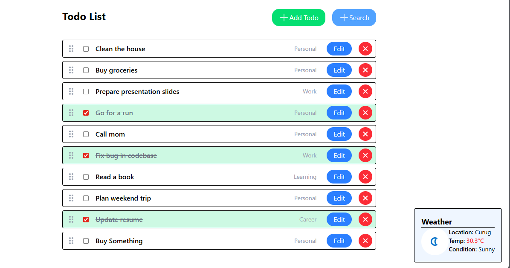
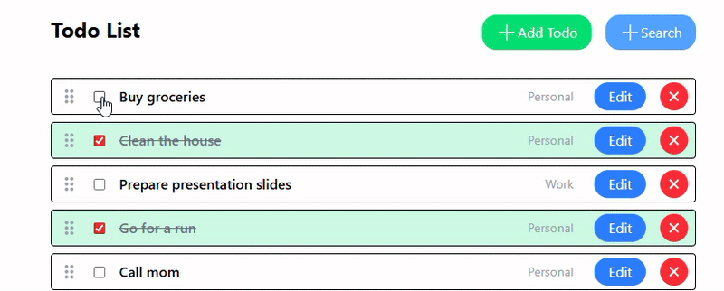
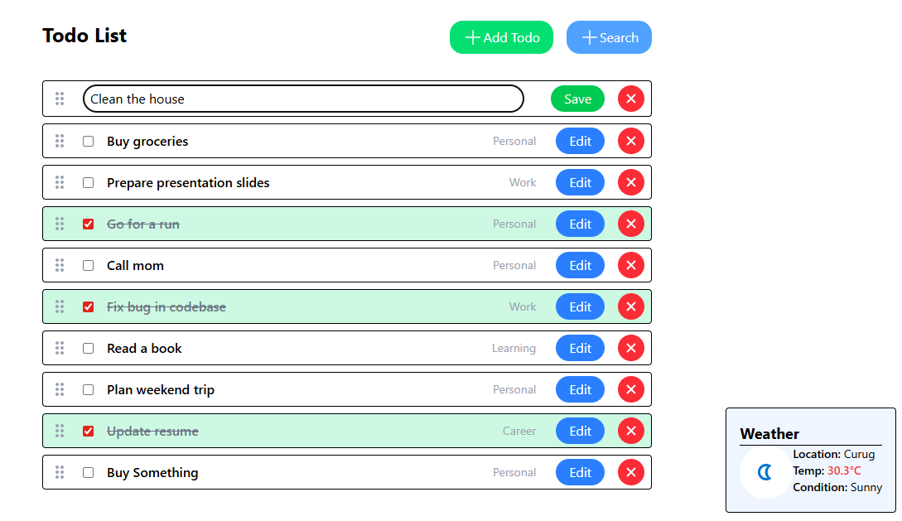
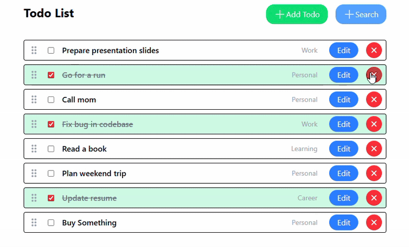
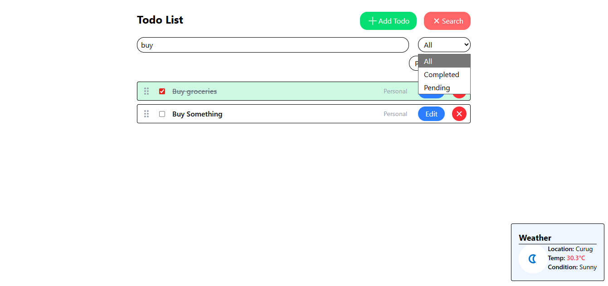
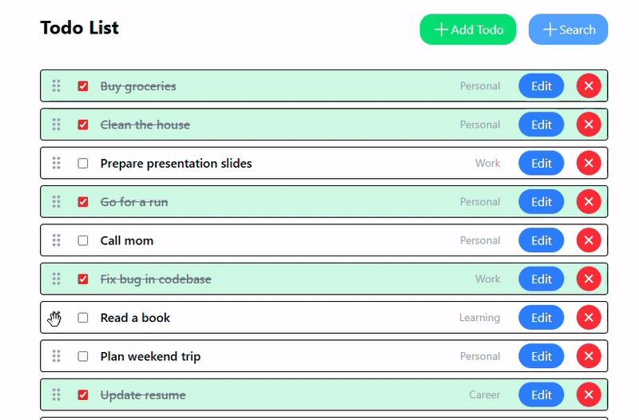

# Todo App

A simple Todo application built with React, Redux, and Typescript.



## Installation

1. Clone the repository:
```
git clone https://github.com/Weeks-S/Offline-Todo-List.git
```
2. Install dependencies:
```
cd Offline-Todo-List
npm install
```
3. Create a `.env` file in the root directory and add your Weather API key:
```
VITE_WEATHER_API_KEY=your-api-key
```
4. Start the development server:
```
npm run dev
```

## Usage

The Todo App allows you to:

- **Add new tasks**
> 
---
- **Mark tasks as completed or pending**
> 
---
- **Edit task names**
> 
---
- **Delete tasks**
> 
---
- **Search and filter tasks by status and category**
> 
---
- **Reorder tasks using drag and drop**
> 


## API

The application uses the following APIs:

1. **Todo Service**:
   - `getTodos()`: Retrieves all the todos.
   - `addTodo(name: string, category?: category)`: Adds a new todo.
   - `updateTodo(id: number, updates: Partial<Todo>)`: Updates an existing todo.
   - `deleteTodo(id: number)`: Deletes a todo.
   - `toggleTodo(id: number)`: Toggles the status of a todo.
   - `searchTodos(searchTerm: string, statusFilter: "All" | "Completed" | "Pending", categoryFilter: category | "All")`: Searches and filters todos.

2. **Weather Service**:
   - `fetchWeather(lat: number, lon: number)`: Fetches the current weather information based on the provided latitude and longitude.

## License

This project is licensed under the [MIT License](LICENSE).
